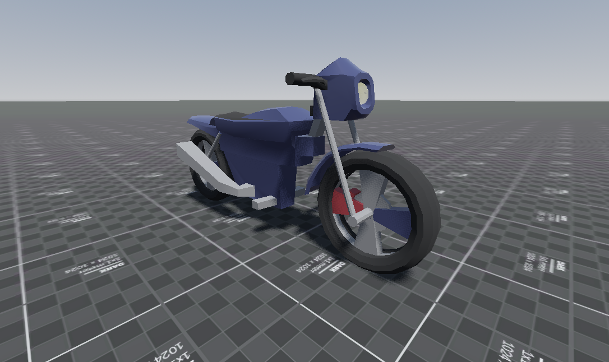

# Motorcycle in Godot 4+



## 🛠️ Prerequisites
- I used Godot Engine 4.4+ for this project

## ⚙️ Configuration Steps
### 1. Physics FPS Settings
**Prevent weird wheel behavior** by setting the physics tick rate:
```
# In your project settings:
Physics -> Common -> Physics FPS = 120
```
## 🛠️ Motorcycle Model
- [Low-Poly Motorcycle Model](https://sketchfab.com/3d-models/low-poly-motorcycle-4fc3500e04b14e73b942d85bc948c5e9)
